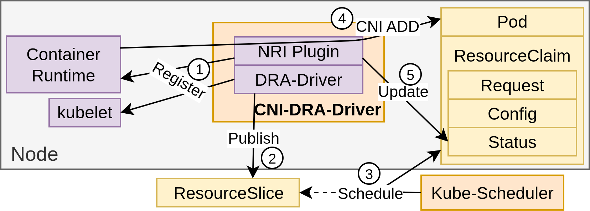

# CNI-DRA-Driver

CNI-DRA-Driver is a Kubernetes Network (DRA) Driver (KND) enabling multiple network interfaces to be added to pods via the CNI (Container Network Interface) API.

This work is, for now, experimental!

## How it works

The CNI-DRA-Driver begins by registering itself as a kubelet plugin using the Dynamic Resource Allocation (DRA) API. Simultaneously, it registers as a Node Resource Interface (NRI) plugin to the container runtime enabling it to intercept pod creation and deletion events.

After registration, the driver publishes the network resources available on each node, making them visible to the cluster. At this point, the driver is fully operational and ready for use. Cluster administrators can then define device classes associated with the cluster, mapping them to the published network resources.

When a pod is created with a ResourceClaim referencing the CNI-DRA-Driver resources, the driver intercepts the pod creation event. It retrieves the CNI configuration associated with the request of the ResourceClaim and executes a CNI ADD operation. The result of this operation is stored in the status of the ResourceClaim for the allocated device.



## Quick Start

The CNI-DRA-Driver can quickly be deployed:
```sh
kubectl apply -f https://raw.githubusercontent.com/kubernetes-sigs/cni-dra-driver/refs/heads/main/deployments/cni-dra-driver.yaml
```

A [demo](docs/demo/readme.md) is also available.

## Community, discussion, contribution, and support

Learn how to engage with the Kubernetes community on the [community page](http://kubernetes.io/community/).

You can reach the maintainers of this project at:

- [Slack](https://kubernetes.slack.com/messages/sig-network)
- [Mailing List](https://groups.google.com/a/kubernetes.io/g/sig-network)

### Code of conduct

Participation in the Kubernetes community is governed by the [Kubernetes Code of Conduct](code-of-conduct.md).
