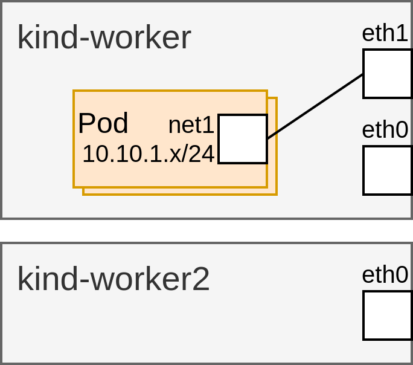

# Demo

This demo showcases a simple use case for the CNI DRA Driver in a non-uniform Kubernetes cluster with two nodes. One node has two network interfaces (eth0 and eth1), while the other has only one (eth0). The scenario demonstrates how a user can deploy pods that require an eth1 interface to create a macvlan interface. It highlights the integration of DRA for scheduling the pod onto the appropriate node, CNI for configuring the network interface, and the ResourceClaim for storing the status of the newly created device.



Set up a registry and build/push the CNI DRA Driver image:
```sh
MY_REGISTRY=localhost:5000/cni-dra-driver
make push-image REGISTRY=$MY_REGISTRY VERSION=latest
(cd ./deployments/cni-dra-driver/ && kustomize edit set image cni-dra-driver=$MY_REGISTRY/cni-dra-driver:latest)
```

Create and prepare a local Kubernetes cluster using Kind:
```sh
# Kind cluster with 2 worker nodes and `DynamicResourceAllocation`, `DRAResourceClaimDeviceStatus` and `DRAAdminAccess` feature gates enabled.
kind create cluster --config docs/demo/kind-config.yaml
# Install CNI Plugins.
kubectl apply -f https://raw.githubusercontent.com/k8snetworkplumbingwg/multus-cni/master/e2e/templates/cni-install.yml.j2
# Create a enp0s10 on kind-worker.
docker exec -it kind-worker ip link add enp0s10 link eth0 type macvlan mode bridge
# Create a enp0s10 on kind-worker2.
docker exec -it kind-worker2 ip link add enp0s10 link eth0 type macvlan mode bridge
# Deploy the CNI-DRA-Driver.
kubectl apply -k ./deployments/cni-dra-driver/
```

Check that nodes and pods are running:
```sh
kubectl get nodes
kubectl get pods --all-namespaces -o wide
```

Inspect network interfaces on worker nodes:
```sh
docker exec -it kind-worker ip -br link show
docker exec -it kind-worker2 ip -br link show
docker exec -it kind-worker3 ip -br link show
```

Check the ResourceSlices:
```sh
kubectl get resourceslice
# kind-worker-cni-dra-driver contains the eth0 and enp0s10 network interfaces.
kubectl get resourceslice kind-worker-cni-dra-driver -o yaml
# kind-worker-cni-dra-driver contains the eth0 and enp0s10 network interfaces.
kubectl get resourceslice kind-worker2-cni-dra-driver -o yaml
# kind-worker-cni-dra-driver contains the eth0 network interface.
kubectl get resourceslice kind-worker3-cni-dra-driver -o yaml
```

Apply the demo A manifests:
```sh
kubectl apply -f docs/demo/pod-A.yaml
```

Apply the demo B manifests:
```sh
kubectl apply -f docs/demo/deployment-B.yaml
```

Check the ResourceClaim for Pod-A:
```sh
# resourceclaim requesting 10 gbps of enp0s10 to create a macvlan net1 interface on top of it with an IP from the 10.10.1.0/24 subnet.
kubectl get resourceclaim macvlan-enp0s10-attachment-a -o yaml
```

Check the ResourceClaimTemplate for Deployment-B:
```sh
# resourceclaimtemplate requesting 5 gbps of enp0s10 to create a macvlan net1 interface on top of it with an IP from the 10.10.1.0/24 subnet.
kubectl get resourceclaimtemplate macvlan-enp0s10-attachment-b -o yaml
```

Check the pod-a deployment:
```sh
# Pod-A pointing to the macvlan-enp0s10-attachment-a resourceclaim.
kubectl get pod demo-a -o yaml
```

Check the demo-application deployment:
```sh
# 3 replicas pointing to the macvlan-enp0s10-attachment-b resourceclaimtemplate.
kubectl get deployment demo-b -o yaml
```

List and inspect the ResourceClaims:
```sh
# Check a resourceclaim has been created for the 3 demo-b replicas .
kubectl get resourceclaim
# Check the status of the device that has been created for the demo-a pod.
kubectl get resourceclaim -o yaml macvlan-enp0s10-attachment-a
```

Verify that the demo application pods are deployed on node "kind-worker":
```sh
# Check all the demo-a and demo-b pods have been scheduled.
kubectl get pods -o wide
# Check the interface, IP and MAC match the device status in the ResourceClaim.
kubectl exec -it demo-a -- ip a
```